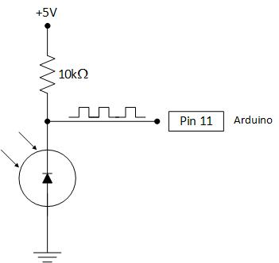
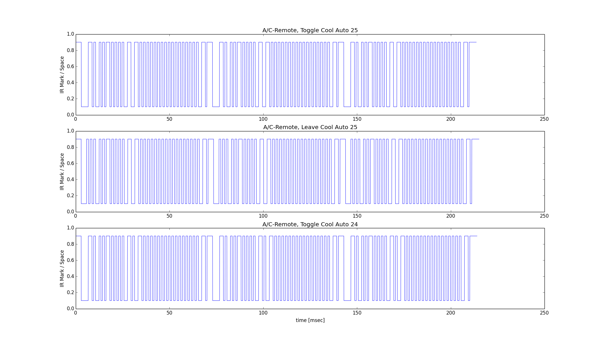

home-control-arduino
====================

EDIT: Modified to work with Uberhaus A/C

Arduino projects and Python tools for my home control system.


Arduino IR Receiver
-------------------

Using this circuit: ,

and loading the [IRACreceiver](IRACreceiver) project to the Arduino, the Arduino will print to serial raw data on received IR signals, in the form:

```
0x12345678 (32 bits)
Raw (182): -27866 3050 -3650 2100 -850 1100 -1800 1050 -800 1150 -800 2050 -850 ...
```

The HEX value is the decoded signal value, and the raw list is a list of IR marks (positive numbers) and spaces (negative numbers) in microseconds - as explained in the [Ken Shirriff's library page] (http://www.righto.com/2009/08/multi-protocol-infrared-remote-library.html).

My A/C is controlled with an IR remote that is not supported and recognized by Ken Shirriff's library.
The [original Arduino-IRremote library](https://github.com/shirriff/Arduino-IRremote) works with up to 100 mark/space buckets, while my A/C remote sends longer signals (around 180-190 buckets), so I [forked the library](https://github.com/itamaro/Arduino-IRremote) in order to add support for my remote.

In my circuit, I used a simple [38KHz IR Photosransistor](http://www.luckylightled.com/UploadFiles/LL-503PTC2E-1AD.pdf).


Arduino A/C IR Sender
---------------------

Using this circuit: ,

and loading the [IRACsender](IRACsender) project to the Arduino, the Arduino will send (preconfigured) IR signals according to commands received via serial input.

| Command | Description
|---------|-----------------------------------------------------------------------------------------
|  `S`    | Initiate IR transmission of current state (if state not valid - print an error message)
|  `P0`   | IR signal will toggle A/C power state
|  `P1`   | IR signal will leave A/C power state as it is
|  `M0`   | Set A/C mode to Cool
|  `M1`   | Set A/C mode to Heat
|  `M2`   | Set A/C mode to Fan
|  `M3`   | Set A/C mode to Dry
|  `F0`   | Set A/C fan speed to Auto
|  `F1`   | Set A/C fan speed to Low
|  `F2`   | Set A/C fan speed to Medium
|  `F3`   | Set A/C fan speed to High
|  `T##`  | Set temperature to the 2-digit number "##"

### Feedback

The state-setting commands (P, M, F, and T) echo back with messages "\<Parameter-name\> parameter set to \<new-value\>"
(or "Invalid \<parameter-name\> value").

The IR-transmission initiation command (S) reports several status messages:
- "Error in send A/C command - not all parameters set" -- if one of the state parameters was not set to a valid value.
- "Sending A/C command with following parameters: Power=\<pwr\>, Mode=\<mode\>, Fan=\<fan\>, Temperature=\<temp\>" -- in case the state is valid, before actually transmitting anything.
- "Success" -- if IR signal was sent successfully.
- "Unsupported Command" -- if the current state is valid, but an IR signal for that state is not preconfigured.

In my circuit I used a simple [IR LED](http://www.4project.co.il/documents/doc_612_811.pdf).


A/C IR Analyzer
---------------
The [A/C IR Analyzer Python script](PyTools/IRAnalysis.py) in the PyTools directory is utility intended to simplify the maintenance of the A/C IR sender project.

As can be seen in the [sender code](IRACsender/IRACsender.ino#L55), all preconfigured commands are hard-coded raw buffers representing raw IR signals that can be sent using the Arduino-IRremote library, followed by a "selector" function that returns a pointer to a specific raw buffer that matches the current state (if supported).

This can be hard to maintain manually (e.g. adding additional commands, adjusting the buffers for another A/C, etc.), so I don't :-)

The [A/C IR Analyzer Python script](PyTools/IRAnalysis.py) takes the output of the Arduino IR Receiver, with some context, and implements two useful subcommands:
- **graph** -- plots the waveforms of the raw IR samples provided (depends on [matplotlib](http://matplotlib.org/index.html) library)
- **code** -- generates the Arduino code that can be pasted straight into the A/C IR sender project

The output of the Arduino IR Receiver should be given to the script with context on which IR dump represents which A/C command, by passing to the script a path to a directory (using `-d path/to/dir` flag) that contains raw IR dump files.
Each file should be named following the command it represents, in the form "Power-Mode-Fan-Temp", where:
- Power: "Toggle" or "Leave"
- Mode: "Cool", "Heat", "Fan" or "Dry"
- Fan: "Auto", "Low", "Medium" or "High"
- Temp: A 2-digit temperature value
Each raw IR dump file can contain one or more IR samples as received from the Arduino IR Receiver project. The more samples are present in a file, the better the accuracy will be, since the script averages all sampled signals.

### Examples of IR Analysis

Graphing signals for 3 commands using `python IRAnalysis.py -d test-data/IRdumps graph` produces .

Generating code for the same data set using `python IRAnalysis.py -d test-data/IRdumps code` produces this code snippet:

```c
PROGMEM prog_uint16_t uSendBuff_Toggle_Cool_Auto_25[] = {181, 3000, 3700, 2050, 900, 1050, 1850, 1050, 850, 1100, 850, 2050, 900, 1050, 850, 1050, 900, 1050, 900, 1050, 1850, 1950, 1850, 2050, 850, 1050, 850, 1050, 900, 1050, 900, 1050, 900, 1050, 850, 1050, 900, 1050, 900, 1050, 900, 1050, 850, 1050, 900, 1050, 850, 1050, 900, 1050, 850, 1050, 900, 1050, 900, 1050, 900, 1050, 1750, 2050, 800, 3000, 3750, 2050, 900, 1050, 1800, 1050, 850, 1100, 800, 2050, 900, 1050, 850, 1050, 900, 1050, 900, 1050, 1800, 2000, 1850, 2050, 900, 1050, 850, 1050, 900, 1050, 900, 1050, 900, 1050, 800, 1050, 900, 1050, 900, 1050, 900, 1050, 850, 1050, 900, 1050, 900, 1050, 900, 1050, 800, 1050, 900, 1050, 900, 1050, 850, 1050, 1750, 2050, 850, 3000, 3750, 2050, 900, 1050, 1850, 1050, 850, 1100, 800, 2050, 900, 1050, 800, 1050, 900, 1050, 900, 1050, 1800, 2000, 1800, 2050, 900, 1050, 800, 1050, 900, 1050, 900, 1050, 900, 1050, 850, 1050, 900, 1050, 850, 1050, 900, 1050, 850, 1050, 900, 1050, 900, 1050, 900, 1050, 850, 1050, 900, 1050, 900, 1050, 900, 1050, 1750, 2050, 850, 3950};
PROGMEM prog_uint16_t uSendBuff_Leave_Cool_Auto_25[] = {187, 2950, 2850, 1000, 950, 1050, 900, 1050, 1850, 1000, 850, 1100, 850, 2000, 950, 1050, 850, 1000, 950, 1000, 950, 1050, 1850, 1950, 1850, 2000, 950, 1000, 850, 1000, 950, 1000, 950, 1050, 900, 1050, 850, 1000, 950, 1050, 900, 1000, 950, 1000, 850, 1050, 900, 1000, 950, 1000, 950, 1050, 850, 1000, 950, 1050, 900, 1050, 950, 1000, 1800, 2000, 900, 3000, 2850, 1000, 950, 1050, 900, 1000, 1900, 1050, 850, 1050, 900, 2000, 950, 1050, 850, 1000, 950, 1050, 900, 1000, 1900, 2000, 1850, 2000, 950, 1050, 850, 1000, 950, 1050, 950, 1050, 900, 1000, 900, 1050, 900, 1000, 950, 1000, 950, 1050, 850, 1000, 950, 1000, 950, 1050, 900, 1000, 900, 1050, 950, 1050, 900, 1000, 950, 1000, 1800, 2000, 900, 3000, 2850, 1050, 900, 1000, 950, 1000, 1850, 1050, 900, 1050, 900, 2050, 900, 1000, 900, 1050, 900, 1050, 950, 1000, 1900, 1950, 1900, 2050, 900, 1050, 900, 1000, 950, 1050, 900, 1000, 950, 1000, 850, 1050, 950, 1000, 950, 1000, 950, 1050, 850, 1000, 950, 1050, 900, 1050, 950, 1000, 900, 1050, 900, 1000, 950, 1000, 950, 1050, 1800, 2000, 850, 3900};
PROGMEM prog_uint16_t uSendBuff_Toggle_Cool_Auto_24[] = {181, 3000, 3750, 2000, 900, 1050, 1850, 1000, 850, 1100, 850, 2000, 900, 1000, 850, 1000, 900, 1000, 900, 1050, 1850, 1950, 900, 1050, 1850, 2000, 850, 1050, 900, 1000, 900, 1000, 900, 1050, 850, 1000, 900, 1050, 900, 1000, 950, 1000, 850, 1050, 900, 1000, 900, 1000, 900, 1050, 850, 1000, 900, 1000, 900, 1050, 900, 1000, 1800, 2000, 850, 3000, 3750, 2050, 900, 1000, 1850, 1000, 850, 1100, 850, 2000, 900, 1050, 850, 1000, 900, 1000, 900, 1050, 1850, 1950, 900, 1000, 1850, 2000, 850, 1000, 900, 1000, 900, 1050, 900, 1000, 850, 1000, 900, 1000, 950, 1000, 900, 1000, 850, 1000, 900, 1000, 900, 1000, 900, 1000, 850, 1000, 900, 1050, 900, 1000, 950, 1000, 1800, 2000, 850, 2950, 3750, 2000, 950, 1000, 1850, 1000, 900, 1050, 850, 2000, 900, 1000, 850, 1000, 950, 1000, 950, 1000, 1850, 1950, 950, 1000, 1850, 2000, 900, 1000, 950, 1000, 900, 1000, 950, 1000, 850, 1000, 950, 1000, 950, 1000, 900, 1050, 850, 1000, 900, 1000, 900, 1000, 950, 1000, 850, 1050, 900, 1000, 900, 1000, 900, 1000, 1800, 2000, 850, 3900};

prog_uint16_t * getAcSendBuff() {
	if ( (Toggle == pwr) && (Cool == mode) &&(Auto == fan) && (25 == temp) ) { return uSendBuff_Toggle_Cool_Auto_25; }
	if ( (Leave == pwr) && (Cool == mode) &&(Auto == fan) && (25 == temp) ) { return uSendBuff_Leave_Cool_Auto_25; }
	if ( (Toggle == pwr) && (Cool == mode) &&(Auto == fan) && (24 == temp) ) { return uSendBuff_Toggle_Cool_Auto_24; }
	return 0;
}
```


Dependencies and Requirements
-----------------------------

Obviously, the Arduino IR Receiver and Sender depend on the Arduino-IRremote library (specifically - [the version I forked and modified](https://github.com/itamaro/Arduino-IRremote)).

The Arduino projects were compiled successfully with Arduino IDE v1.0.5 on my Windows 7 machine, and run successfully on Arduino Uno.

The Python script works with Python 2.7 on my Windows 7 machine, and requires [matplotlib](http://matplotlib.org/index.html) for graphing (I had v1.3.0 when testing, but v1.2.1 also worked).
